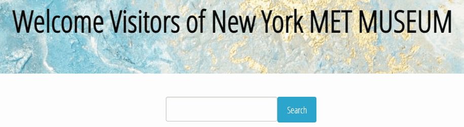

# NY_MET_MUSEUM - Project #1
## TEAM NAME: THE ARTISTS
**New York MET Museum - Webtour to the museum and look for interesting places in NY**
\
 
## Description 🏚

_This application was developed for a common tourist that wants to visit the New York Met Museum and later the tourist wants to search interesting places in New York that are closest to the museum._
\
 

## Instructions 🚀

`1. Search for an artwork in NY MET Museum`
* You can search an artwork in the New York Met Museum just type your search by the followin types: 
    * `Name of the Artist` 
    * `Name of the Artwork` 
    * `Topic of the Artwork`

    

* Please select one of the artwork that the app shows to get information of that artwork:

    

* After that you can see the name of the artist, date, dimensions and the picture of the artwork:

    

\
 
`2. Search for interesting places near the museum`
* You can search for interesting places for visitting after going to the museum, just select the search button in the middle of the page like this:
    
* The available results will be displayed, you can see the name of the place, and the ranking:
    
### Pre-requisites 📋

_Have Google Chrome, Microsoft Edge, Safari or any new browser installed in your pc | mac capable of displaying HTML5._
\
 

### Installation 🔧

_No installation neccesary for this project._
\
 
### Build with 🛠️
* [Jquery](https://jquery.com/) - `Javascript Library`
* [CSS Foundation Framework](https://get.foundation/) - `CSS Advanced Framework`
* [API - MET API](https://metmuseum.github.io/) - `The Metropolitan Museum of Art Collection API`
* [API - OpenTripMap](https://opentripmap.io/product) - `OpenTripMap API`
\
 
### Links ❔
* [GITHUB Repository](https://github.com/ragexxx/NY_MET_MUSEUM) - `NY MET MUSEUM REPOSITORY`
* [Live URL - Github Pages](https://ragexxx.github.io/NY_MET_MUSEUM/) - `NY MET Webpage`
\
 
## Authors ✒️
*THE ARTISTS TEAM:*
* **`Yazmin Tinoco`**   - [Yazmin30-bot](https://github.com/Yazmin30-bot/)
* **`Alsynoe Arista`**  - [alarista](https://github.com/alarista/)
* **`Miranda Ramirez`** - [mirandarmz](https://github.com/mirandarmz/)
* **`Rigel Trujillo`**  - [ragexxx](https://github.com/ragexxx/)
\
 
## Special Thanks 🎁
* `Tyler Sensei` 👨‍🏫
* `Emily Master` 👩‍🏫 
* `BOOTCAMP` 🎒

---
Developed With ❤️ by **THE ARTISTS** 😊